# RTSE

A save editor for Borderlands 2 that works while you're playing.

You don't quit the game, find your save file and edit it in some other tool. You hit **F8** in game, a page opens in your browser, and whatever you change shows up in the game right away. Change a gun's parts, bump your level, fill your ammo, unlock a fast travel station, whatever. Save in game like normal and it sticks.

It runs on the [bl-sdk](https://bl-sdk.github.io/willow2-mod-db/) mod loader, so it's just one more mod in your `sdk_mods` folder.

## What you can do with it

- **Gear:** open any weapon or item in your backpack or equipped, swap its parts, change its level, tweak its stats. There's a 3D view of the gun that updates as you go.
- **Character:** level, XP, skill points, cash, eridium, seraph crystals, torgue tokens.
- **Ammo:** see and set every ammo type.
- **Upgrades:** backpack, bank and ammo SDU levels, like the Gibbed editor has.
- **Skills:** your real skill tree for your class. Set any skill to any rank (even locked ones), change unspent points, or reset the whole tree.
- **World:** missions, challenges, fast travel stations and playthrough (Normal / TVHM / UVHM).

## A tour of the editor

The screenshots below were taken with the demo data from `dev/mock_server.py` (see [For tinkerers](#for-tinkerers)), not from a live game, so the names and numbers are placeholders. In the real thing they come from your character.

The left side is always your **Loadout**: five pages pinned at the top (Character, Ammo, Upgrades, Skills, World), then a search box and everything you have equipped or in your backpack.

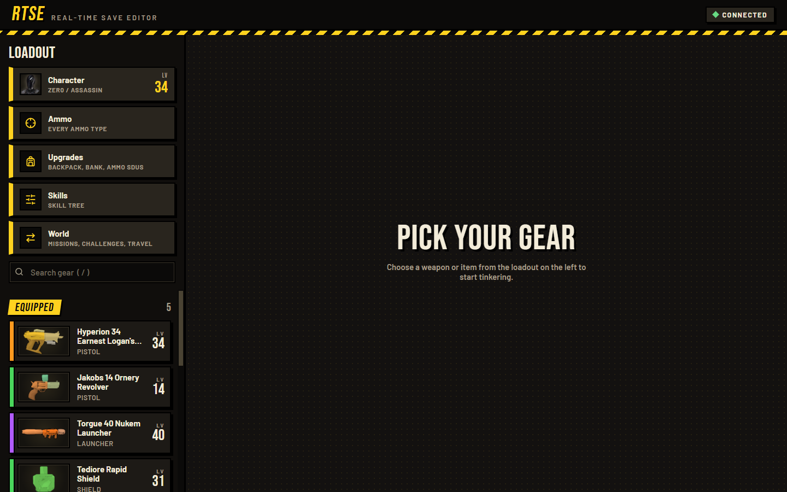

### Gear

Click any weapon, shield, grenade mod, relic or class mod in the list.

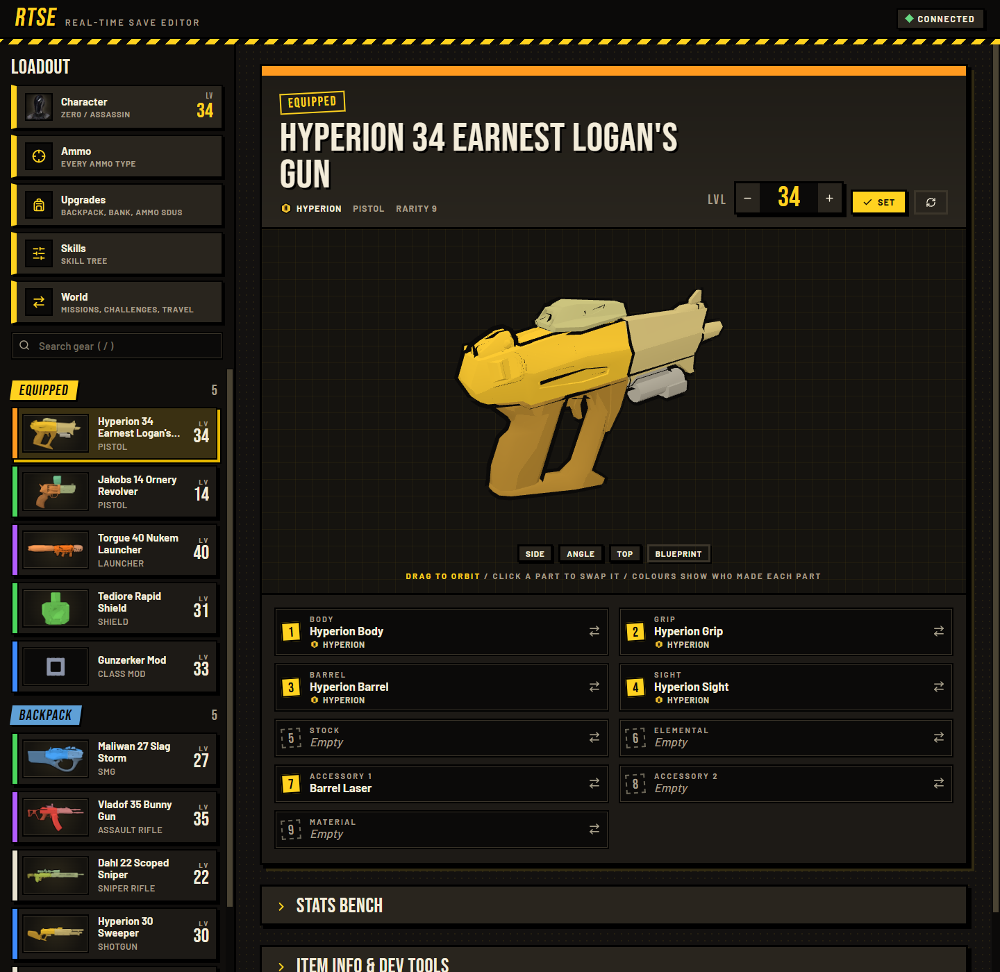

- **3D view.** Drag to orbit, or use **Side / Angle / Top / Blueprint**. Click a part on the model to swap it. Colours show which manufacturer made each part.
- **Level.** Change the item's level with the stepper and hit **Set**.
- **Part slots.** One tile for each slot (body, grip, barrel, sight, stock, element, accessories, material). Empty slots are dashed. Click a tile to swap that part.

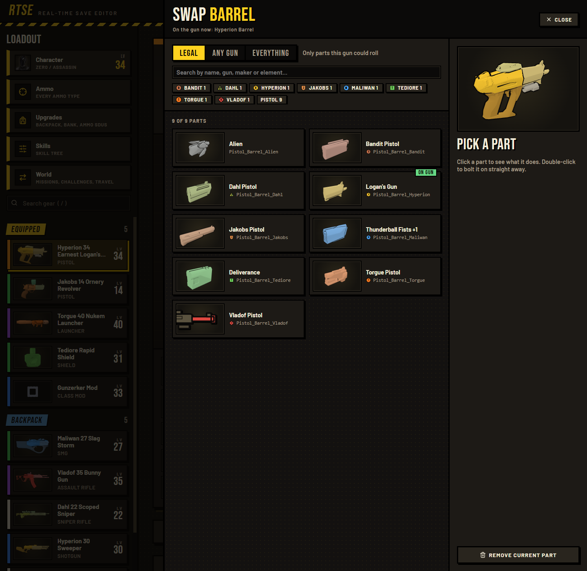

- **Part picker.** **Legal** shows only parts this gun could roll in the game. **Any gun** shows parts from other guns of the same type. **Everything** shows every part in the game. You can search by name, maker or element, filter by manufacturer, and see a preview of the gun with the part on it. Double-click a part to bolt it on, or **Remove current part**.

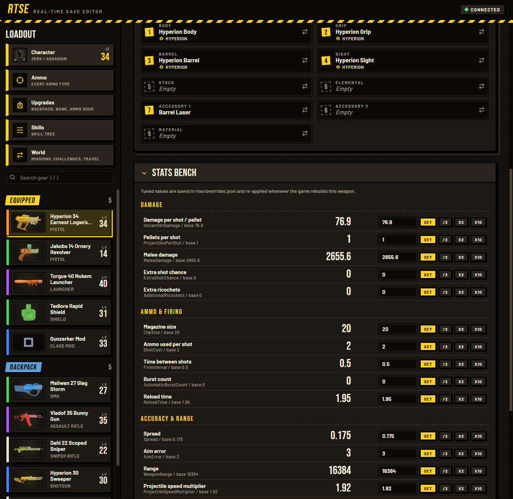

- **Stats bench.** The gun's real numbers (damage, magazine size, reload time, spread, range and so on) with the game's base value next to each one. Type a number and **Set**, or use **/2, x2, x10**. Your tuned values are saved in `rtse/overrides.json` and re-applied whenever the game rebuilds that weapon.
- **Item info & dev tools** (below the stats) has the item's id, class, level requirement and game stage, plus the **Save ... dump** buttons for bug reports.

### Character

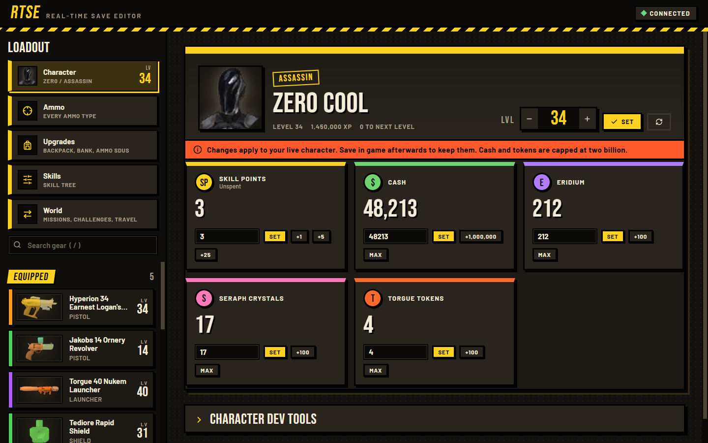

Your level and XP, plus unspent **skill points**, **cash**, **eridium**, **seraph crystals** and **torgue tokens**. Each one has a box to type an exact value and **Set**, quick **+** buttons, and **Max** where it makes sense. The game caps cash and tokens at two billion.

### Ammo

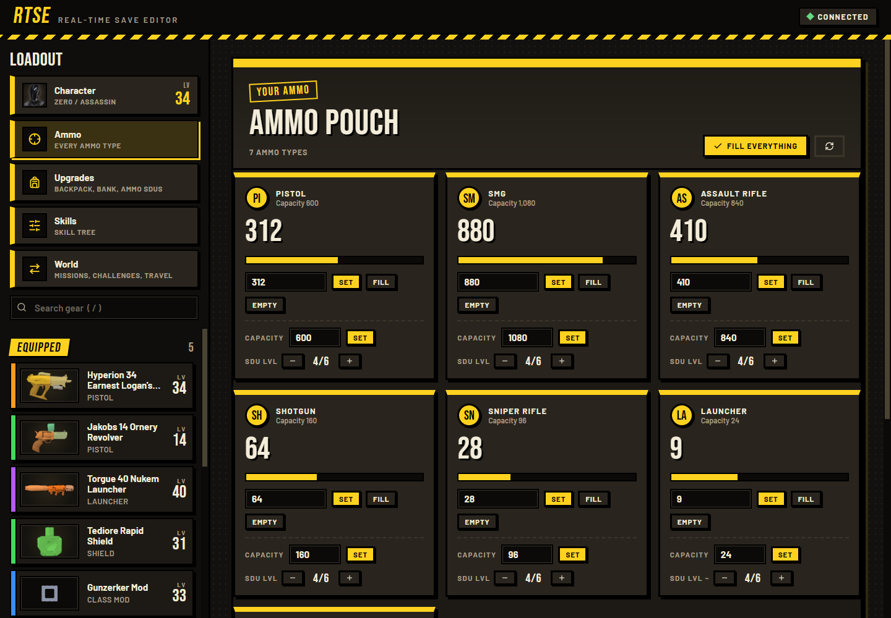

One card per ammo type with how much you have, your capacity and how full that is. **Set** an exact amount, **Fill** to capacity, **Empty** it, change the capacity directly, or change the ammo SDU level. **Fill everything** tops up all types at once.

### Upgrades

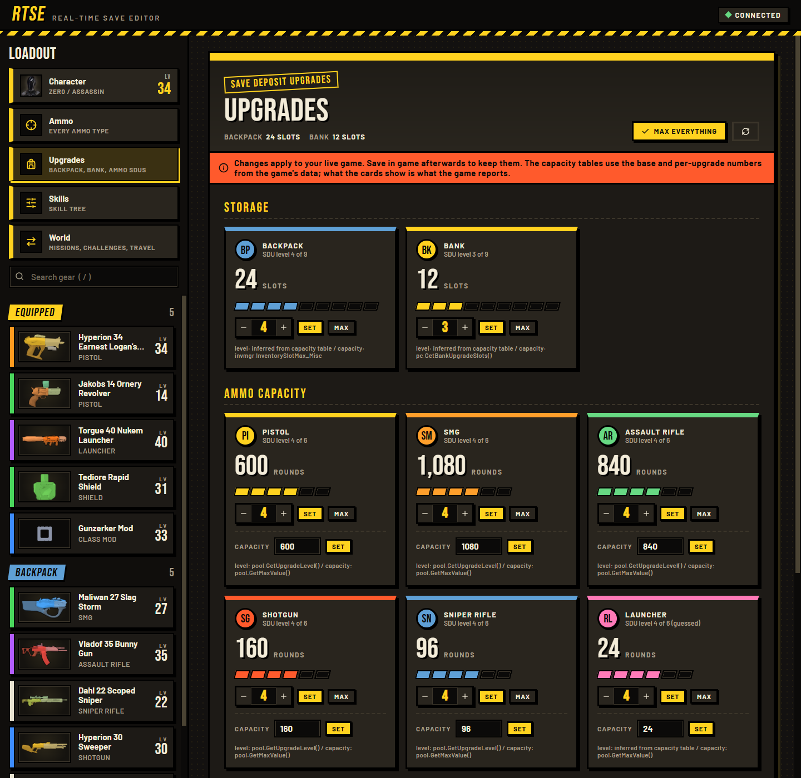

Your SDU (Storage Deck Upgrade) levels, the same idea as the Gibbed editor. **Backpack** and **Bank** slots, and **Ammo capacity** for every ammo type. Step the level up or down, **Set** it, or **Max** it. **Max everything** does the lot. Each card says where the game's number came from.

### Skills

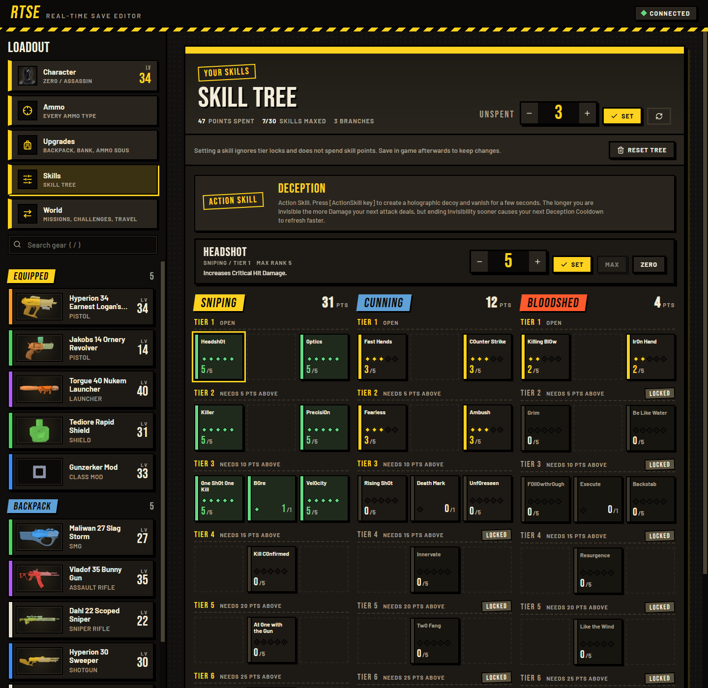

The real skill tree for your class (Zer0 in this picture), straight from the game's own data. Your action skill is at the top. Click any skill to read what it does and set it to an exact rank with the stepper, **Max** or **Zero**. This ignores tier locks, so you can put points into locked skills. It doesn't spend skill points. You can also set your **Unspent** points, or **Reset tree**.

### World

The **World** page has four tabs.

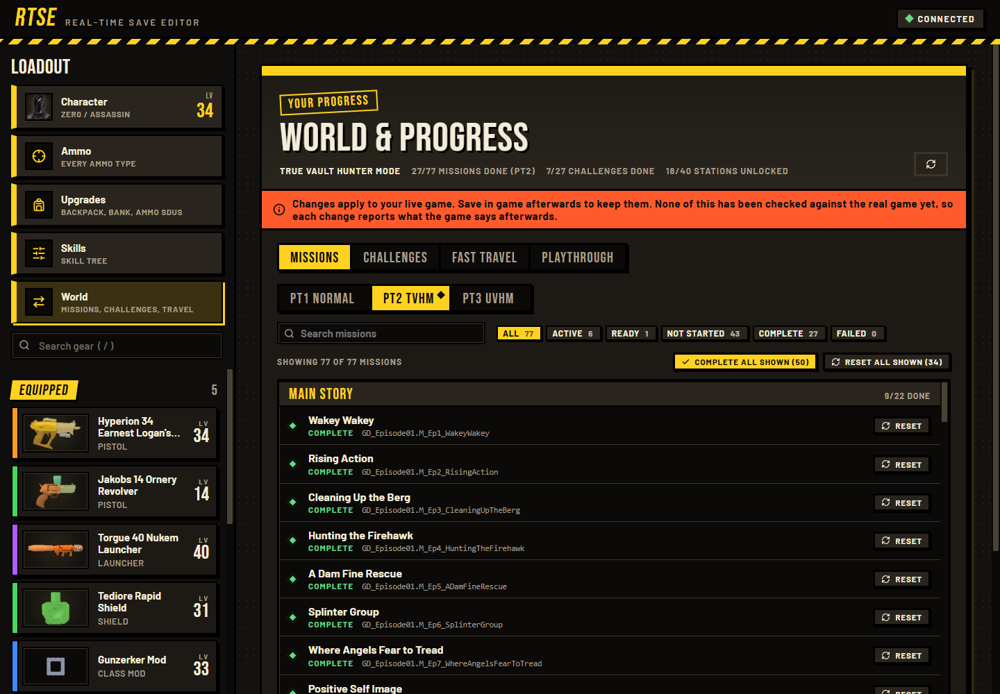

- **Missions.** Every mission, grouped by storyline, with its state. Pick the playthrough (PT1 Normal, PT2 TVHM, PT3 UVHM) and filter by Active, Ready, Not started, Complete or Failed. Search by name. **Reset** one mission, or **Complete all shown / Reset all shown** for whatever the filters currently show.

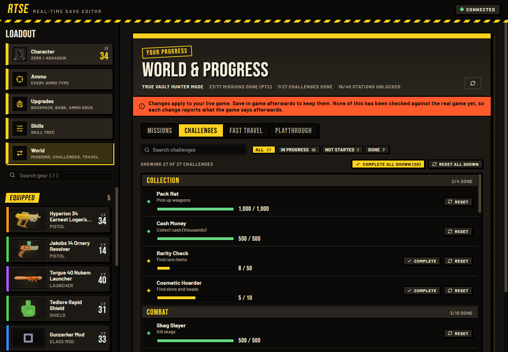

- **Challenges.** Each challenge with a progress bar. **Complete** or **Reset** one at a time, or everything shown.

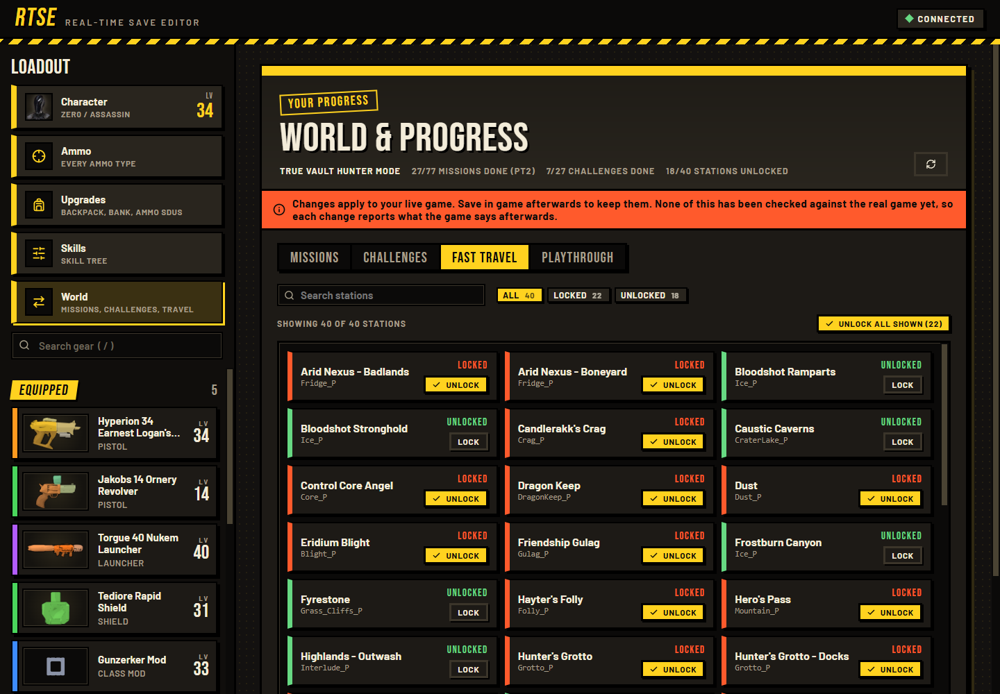

- **Fast travel.** Every fast travel station, locked or unlocked. **Unlock** or **Lock** one, or **Unlock all shown**.

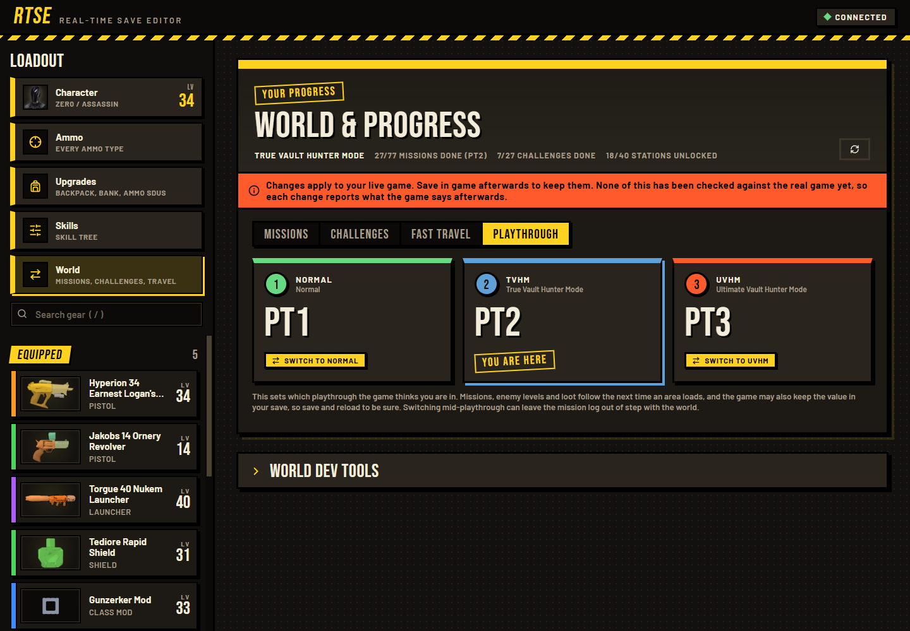

- **Playthrough.** Shows which playthrough you're in and lets you switch between Normal, TVHM and UVHM. Read the note on that page first: save and reload afterwards, since switching mid-playthrough can leave your mission log out of step.

## Heads up before you start

- **Back up your saves first.** They're in `Documents\My Games\Borderlands 2\WillowGame\SaveData`. Copy that folder somewhere. It takes ten seconds and saves you if you break something.
- **Play solo.** Don't use this in public online games.
- **This is early.** Gear is the page that's had the most real use. Character, Ammo, Upgrades, Skills and World were built from the game's own data files, so the names they use are real, but nobody has confirmed every button does what it says in a live game yet. If something shows "unavailable" or does nothing, see [When something doesn't work](#when-something-doesnt-work).

## Easiest way to install: let Claude do it

Send this repo to Claude (Claude Code works great, since it can touch your files) and say something like:

> Install RTSE from https://github.com/zuhuHix/Bl2_RTSE into my Borderlands 2. Set up the bl-sdk mod loader first if I don't have it.

It'll find your game folder, set up the mod loader if needed, and put RTSE in the right place. Other coding assistants that can work on your computer will do the same job.

## Install it yourself

1. **Get the mod loader (bl-sdk) if you don't have it.**
   - Install the latest [Microsoft Visual C++ Redistributable](https://learn.microsoft.com/en-us/cpp/windows/latest-supported-vc-redist) if you haven't.
   - Download the latest release from [bl-sdk/willow2-mod-manager](https://github.com/bl-sdk/willow2-mod-manager/releases) (the release zip, not "Source code").
   - Unzip it straight into your Borderlands 2 folder, usually `C:\Program Files (x86)\Steam\steamapps\common\Borderlands 2`. Let it merge with what's there.
   - Start the game once. If you see a **MODS** option on the main menu, it worked.
   - On Linux / Steam Deck, add `WINEDLLOVERRIDES="ddraw=n,b" %command% -pf_tricks=vcrun2022` to the game's launch options.

2. **Put RTSE in the mod folder.**
   - Download this repo (green **Code** button, then **Download ZIP**) and unzip it.
   - Copy the `rtse` folder into the game's `sdk_mods` folder, so you end up with `Borderlands 2\sdk_mods\rtse\__init__.py`. Don't nest it an extra folder deep.

3. **Play.** Launch the game and load into a character. Press **F8**. Your browser opens with the editor.

If F8 does nothing, open the mod menu and check RTSE is enabled. You can also rebind the key there. The editor's address (it starts with `http://127.0.0.1`) is printed in the game's console and in `unrealsdk.log`, so you can paste it into a browser yourself.

## Using it

- Click a page on the left (Character, Ammo, Upgrades, Skills, World) or pick a gun or item from the list.
- Changes happen in your live game. **Save in game afterwards** (quit to the menu or use a save point) or they're gone when you leave.
- Each change tells you what the game reports back. If you ask for 500 and the game says 300, it'll tell you, since the game sometimes caps things.
- The editor only listens on your own computer, and the link has a random key in it. Nobody else on your network can use it.

## When something doesn't work

Every page has a **dev tools** dropdown at the bottom with a **Save ... dump** button. Click it while you're in game and RTSE writes a small file, `rtse/debug_<page>.json`, showing what the game actually has. If a page says "unavailable" or a button does nothing, open an [issue](https://github.com/zuhuHix/Bl2_RTSE/issues) and attach that file. That's how the guesses get fixed.

## For tinkerers

You can try the whole editor without the game, using fake data:

```
python dev/mock_server.py 8766
```

then open `http://127.0.0.1:8766/?t=mock`.

Other bits in `dev/`:

- `smoke_server.py` checks the web server's security basics.
- `audit_names.py` checks every game-side name RTSE uses against the game's real class definitions (it reads your installed game).
- `extract_skills.py` rebuilds `rtse/skilltrees.json` (the skill trees) from your installed game.

The mod itself is plain Python and vanilla JavaScript, no build step.

RTSE isn't affiliated with Gearbox or 2K. Skill names and descriptions in `rtse/skilltrees.json` come from the game's own files.
